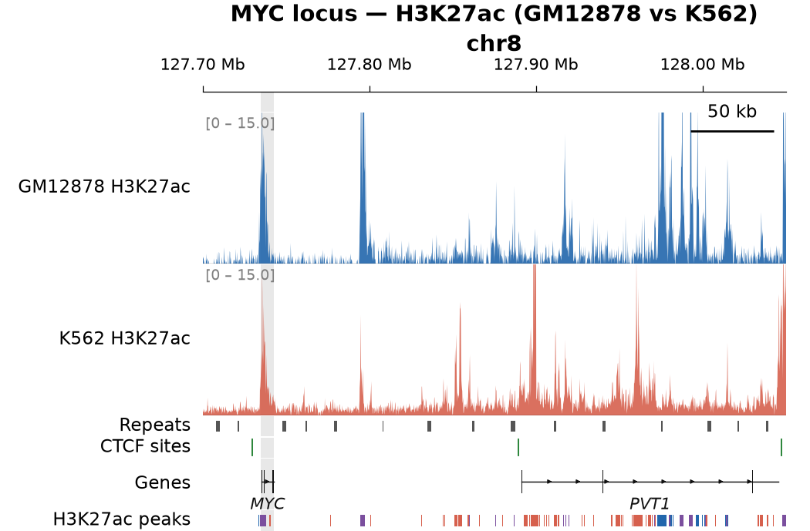

# locus_plot

Publication-quality genome browser track figures from the command line.

`locus_plot.py` renders stacked, IGV-style track panels from BigWig and BED files,
configured via a plain INI file. It is designed for embedding in figure workflows:
output is a single vector (PDF/SVG) or raster (PNG) file, with no interactive GUI required.


---

## Features

- **BigWig signal tracks** — filled area with positive/negative colour split and auto or fixed y-axis
- **BED annotation tracks** — rectangular features with optional per-feature colours and strand arrows
- **Gene model tracks** — BED12 intron/exon structures with directional arrows and italic gene names
- **Tick tracks** — vertical lines for point features (e.g. ChIP peaks, SNPs)
- **Dynseq tracks** — per-base score BigWig rendered as scaled, colored ACGT
  letters (e.g. model contribution/importance scores), falling back to a plain
  signal view when zoomed out too far for individual bases to be legible
- **Group labels** — bracket multiple tracks under a shared left-margin label
- **Highlight column** — grey shaded region spanning all tracks
- **Scale bar** — automatic kb/Mb label
- **Coordinate axis** — auto-scaled ticks at top
- **Font-embedding** — PDF/SVG output uses Type 42 fonts for clean journal submission

---

## Requirements

| Package | Version tested |
|---------|----------------|
| Python  | ≥ 3.9          |
| numpy   | ≥ 1.24         |
| matplotlib | ≥ 3.7       |
| pyBigWig | ≥ 0.3.22      |
| pyfaidx | ≥ 0.7          |

`pyfaidx` is only needed for `dynseq` tracks (it looks up the reference base at
each position); the other track types don't touch it.

Install with conda (recommended):

```bash
conda create -n locus_plot python=3.11 numpy matplotlib pyBigWig pyfaidx -c conda-forge -c bioconda
conda activate locus_plot
```

Or with pip (requires a working libBigWig on your system):

```bash
pip install numpy matplotlib pyBigWig pyfaidx
```

> **Windows users:** `pyBigWig` does not build on native Windows. Run `locus_plot.py`
> inside WSL (Windows Subsystem for Linux) or use the conda install above from within WSL.

---

## Quick start

```bash
python locus_plot.py \
    --region chr19:3200000-3350000 \
    --config example/tracks.ini \
    --out figure.pdf
```

---

## Command-line options

| Option | Default | Description |
|--------|---------|-------------|
| `--region` | *(required)* | Genomic region, e.g. `chr17:18,530,000-18,590,000` |
| `--config` | *(required)* | Path to the INI track configuration file |
| `--out` | *(required)* | Output file path; extension sets format: `.pdf`, `.svg`, or `.png` |
| `--width` | `8` | Figure width in inches. The saved file is always exactly this wide. Also scales font sizes, line widths, and track heights up or down — see [Figure sizing](#figure-sizing) |
| `--height-per-unit` | auto | Inches per track height unit. By default scales with `--width` like everything else; pass a value to fix it regardless of width |
| `--dpi` | `200` | Raster DPI (PNG only) |

Commas in the region string are ignored, so `chr17:18,530,000-18,590,000` and
`chr17:18530000-18590000` are equivalent.

---

## Figure sizing

Font sizes, line widths, and track heights are all tuned for `--width 8` and scale
together from there — a wider `--width` (e.g. for a poster) gets bigger, easier-to-read
text and taller tracks; a narrower one (e.g. for a journal column) gets smaller text and
shorter tracks. The saved file's width always matches `--width` exactly, in every format.

Below about `--width 6.5`, text and track heights stop shrinking and hold at a minimum
readable size — a warning is printed naming what got clamped. Pushing `--width` narrower
than that trades away layout (labels may start to overlap or clip) rather than producing
illegible type. [`example/output_compact.pdf`](example/output_compact.pdf) below shows a
typical single-column journal width (3.5 in), already past that point — the text is at
its floor and still fully legible:



Tracks that draw per-feature name labels inside their own panel (`type = genes`, or
`type = bed` with `show_names` on and `name_col` set) automatically get a bit of extra
height to fit those labels, scaled with the same factor as the text. Tracks without such
labels (`bigwig`, `ticks`, or a `bed` track with `show_names = false`) keep exactly the
height you configure.

---

## Configuration file (INI format)

The INI file has one optional `[_global]` section and one section per track.
Section names beginning with `_` are reserved; all others become track labels.

### `[_global]` options

| Key | Example | Description |
|-----|---------|-------------|
| `highlight` | `18558000-18567000` | Grey shaded column across all tracks (region coordinates) |
| `scalebar` | `5000` | Scale bar length in base pairs |
| `title` | `My locus` | Optional figure title drawn above the coordinate axis |

### Per-track options

| Key | Default | Description |
|-----|---------|-------------|
| `file` | *(required)* | Absolute or relative path to a BigWig or BED file |
| `type` | `bigwig` | Track type: `bigwig`, `bed`, `genes`, `ticks`, or `dynseq` |
| `height` | `1` | Relative track height (fractional values accepted, e.g. `0.3`) |
| `label` | section name | Text displayed to the left of the track |
| `color` | type-specific | Fill / feature colour as a hex code, e.g. `#2166ac` |
| `group` | — | Group label shown further left, spanning all consecutive tracks with the same name |

#### BigWig-specific options

| Key | Default | Description |
|-----|---------|-------------|
| `ylim` | auto | Y-axis limits as `min,max`, e.g. `-1,5` |
| `neg_color` | `#d4d4d4` | Fill colour for negative values |

#### BED-specific options

| Key | Default | Description |
|-----|---------|-------------|
| `color_col` | — | 1-based column index whose value is looked up in `color_map` |
| `color_map` | — | Comma-separated `label:hexcolor` pairs, e.g. `ES:#2166ac,XEN:#d6604d` |
| `name_col` | — | 1-based column index for feature name labels |
| `strand_col` | — | 1-based column index for strand (`+`/`-`) arrow overlays |
| `show_names` | `true` | Set to `false` to suppress name labels |

#### Gene-specific options

| Key | Default | Description |
|-----|---------|-------------|
| `name_sep` | `\|` | Separator used to split the name field when `name_field` is set |
| `name_field` | — | 0-based index into the split name to use as the displayed gene name |

#### Dynseq-specific options

`dynseq` displays a per-base score BigWig (e.g. a model's per-nucleotide
contribution/importance scores, positive or negative) as colored ACGT
letters scaled to the score at each position, in the style of the
[UCSC/WashU/Kundaje Lab dynseq track](https://pmc.ncbi.nlm.nih.gov/articles/PMC10015500/).
Negative scores draw the letter flipped below the zero line. When the region
is too wide for individual bases to be legible at the configured `--width`,
the track automatically falls back to a plain filled signal view instead
(same rendering as a `bigwig` track).

| Key | Default | Description |
|-----|---------|-------------|
| `fasta` | *(required)* | Reference genome FASTA (a `.fai` index is created next to it automatically if missing) |
| `ylim` | auto | Y-axis limits as `min,max`, same as `bigwig` |
| `a_color` | `#109648` | Letter color override for A |
| `c_color` | `#255C99` | Letter color override for C |
| `g_color` | `#F7B32B` | Letter color override for G |
| `t_color` | `#D62839` | Letter color override for T |

See [`example/README.md`](example/README.md#dynseq-example--per-base-importance-scores-at-a-ctcf-site)
for a runnable dynseq example, including a script to fetch a real reference
FASTA and a rendered figure.

```ini
[Contribution scores]
type   = dynseq
file   = data/model_scores.bw
fasta  = data/hg38.fa
height = 1.2
```

---

## Minimal example INI

```ini
[_global]
scalebar = 10000
highlight = 3260000-3280000

[H3K27ac ES]
type   = bigwig
file   = data/ES_H3K27ac.bw
color  = #2166ac
height = 1.2
ylim   = 0,8

[H3K27ac NPC]
type   = bigwig
file   = data/NPC_H3K27ac.bw
color  = #d6604d
height = 1.2
ylim   = 0,8

[Peaks]
type      = bed
file      = data/peaks.bed
color_col = 5
color_map = ES:#2166ac,NPC:#d6604d,shared:#7B4F9E
height    = 0.4
group     = H3K27ac peaks

[Genes]
type       = genes
file       = data/gencode.bed12
color      = #222222
height     = 0.5
```

---

## Output tips

- Use **PDF or SVG** for vector graphics suitable for journal submission.
- `--dpi 300` is conventional for PNG submission; `--dpi 72` is fine for presentations.
- Pass `--height-per-unit` explicitly (e.g. `0.6`) to compress the figure vertically
  regardless of `--width`, instead of relying on the automatic scaling — see
  [Figure sizing](#figure-sizing).
- If track labels or titles are clipped, increase `--width` — below about `6.5in` text
  holds at a minimum readable size rather than shrinking further, so very narrow figures
  trade away layout instead of legibility.

---

## License

MIT — see [LICENSE](LICENSE).
