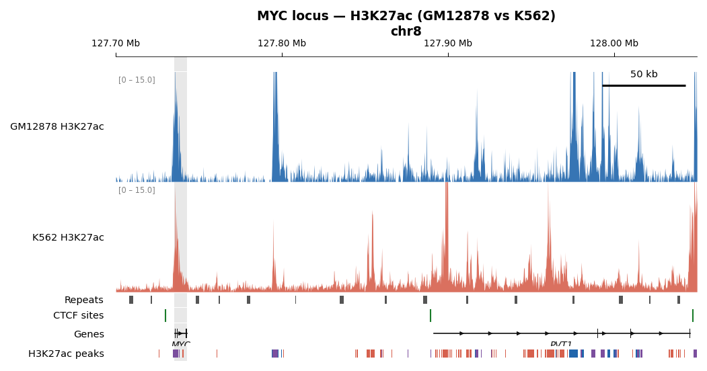

# Example — MYC super-enhancer locus

This example renders a 350 kb window around the MYC gene (hg38, chr8:127,700,000–128,050,000),
comparing H3K27ac ChIP-seq signal between GM12878 and K562 cell lines.



It demonstrates all four track types:

| Track | Type | Source |
|-------|------|--------|
| GM12878 H3K27ac | `bigwig` | ENCODE (downloaded by `fetch_bw.py`) |
| K562 H3K27ac | `bigwig` | ENCODE (downloaded by `fetch_bw.py`) |
| Repeat elements | `bed` | Included in repo |
| CTCF binding sites | `ticks` | Included in repo |
| Gene models (MYC, PVT1) | `genes` | Included in repo |
| H3K27ac peaks (by cell type) | `bed` | Included in repo |

The grey highlight column marks the MYC gene body; the scale bar represents 50 kb.
Peak colours reflect cell-type specificity: blue = GM12878-only, red = K562-only, purple = shared.

---

## Step 1 — Download BigWig files

Requires Python 3 and an internet connection (no extra packages beyond the standard library):

```bash
python example/fetch_bw.py
```

This queries the ENCODE REST API and downloads the latest fold-change-over-control
BigWig files (~180 MB GM12878, ~1 GB K562) into `example/data/`.
BigWig files are excluded from git — see [`data/.gitignore`](data/.gitignore).

> **Note (Windows users):** `pyBigWig` does not build on native Windows.
> Run the download and the plotting step inside WSL (Windows Subsystem for Linux).

To download manually instead, visit the ENCODE portal and save the fold-change BigWig
files as `example/data/GM12878_H3K27ac_fc.bw` and `example/data/K562_H3K27ac_fc.bw`:
- [GM12878 H3K27ac — ENCODE search](https://www.encodeproject.org/search/?type=File&biosample_ontology.term_name=GM12878&assay_title=Histone+ChIP-seq&target.label=H3K27ac&file_format=bigWig&output_type=fold+change+over+control&assembly=GRCh38&status=released)
- [K562 H3K27ac — ENCODE search](https://www.encodeproject.org/search/?type=File&biosample_ontology.term_name=K562&assay_title=Histone+ChIP-seq&target.label=H3K27ac&file_format=bigWig&output_type=fold+change+over+control&assembly=GRCh38&status=released)

---

## Step 2 — Generate the figure

Run from the **repo root**:

```bash
# Vector PDF — for publication / journal submission
python locus_plot.py \
    --region chr8:127700000-128050000 \
    --config example/tracks.ini \
    --out example/output.pdf

# Raster PNG — for presentations or quick inspection
python locus_plot.py \
    --region chr8:127700000-128050000 \
    --config example/tracks.ini \
    --out example/output.png \
    --dpi 150
```

The committed [`output.pdf`](output.pdf) and [`output.png`](output.png) were generated
with the default settings (`--width 8 --height-per-unit 0.8 --dpi 150`).

### Optional variations

```bash
# Wider figure for a two-column layout
python locus_plot.py --region chr8:127700000-128050000 \
    --config example/tracks.ini --out example/output_wide.pdf --width 12

# Zoom into the MYC gene body only
python locus_plot.py --region chr8:127730000-127745000 \
    --config example/tracks.ini --out example/myc_zoom.pdf
```

---

## Included data files

| File | Description |
|------|-------------|
| [`tracks.ini`](tracks.ini) | Track configuration for this example |
| [`fetch_bw.py`](fetch_bw.py) | Python script to download BigWig files from ENCODE |
| [`data/genes.bed12`](data/genes.bed12) | MYC and PVT1 gene models (BED12 format) |
| [`data/repeats.bed`](data/repeats.bed) | Representative repeat elements (LINE, SINE, LTR) |
| [`data/peaks.bed`](data/peaks.bed) | H3K27ac peak regions, categorised by cell-line specificity |
| [`data/ctcf_sites.bed`](data/ctcf_sites.bed) | CTCF binding sites (rendered as tick marks) |
| [`output.pdf`](output.pdf) | Pre-generated vector figure |
| [`output.png`](output.png) | Pre-generated raster figure (150 dpi) |
